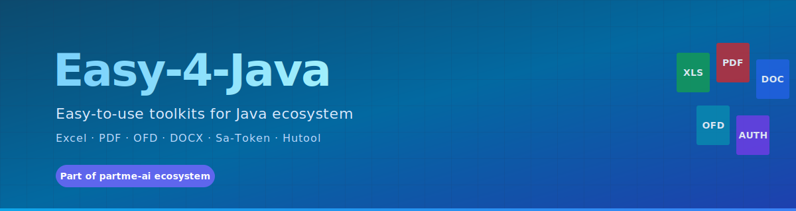

# Easy-4-Java

> **🚧 组织主页（筹备中）**
>
> 这是 [easy-4-rust](https://github.com/easy-4-rust) 的 Java 镜像组织 —— 暂未发布任何仓库。
>
> 如果将来在 Java 生态独立开发业务工具集，会使用本组织托管。
>
> 当前组织下 **0 个仓库**。

  

  
  
  
  

---

## 关于本组织

**Easy-4-Java** 是 [partme-ai](https://github.com/partme-ai) 开源生态下的一个**预留组织**，命名上与 [easy-4-rust](https://github.com/easy-4-rust) 对称。

**当前没有任何已发布项目。**

> 📌 重要说明：本组织**不托管**以下常见 Java 工具的镜像或 fork：
> - [`easyexcel`](https://github.com/alibaba/easyexcel) —— Alibaba 开源项目，独立维护
> - [`sa-token`](https://github.com/dromara/Sa-Token) —— dromara 开源项目，独立维护
> - [`hutool`](https://github.com/dromara/hutool) —— dromara 开源项目，独立维护
>
> 上述项目都有完整的官方仓库和社区，**请直接使用官方版本**。

---

## 🚧 未来可能的方向

如果将来需要在 Java 生态独立开发业务工具集，会在 **Discussions** 里发起 RFC，并优先考虑：

- **与 easy-4-rust 对齐**：每个 Rust crate 都有对应的 Java 实现
- **与 ddd-4-java 集成**：基于现有的 `io.ddd4j` 基础构件
- **生产可用**：完整的 CI/CD、测试覆盖、Maven Central 发布

---

## 📂 相关项目（不归本组织管理）

下面是 **Java 生态已有的、被广泛使用的工具集**，但**不属于 easy-4-java 组织**：

| Java 项目 | 维护方 | 链接 |
|-----------|--------|------|
| `easyexcel` | Alibaba | [github.com/alibaba/easyexcel](https://github.com/alibaba/easyexcel) |
| `sa-token` | dromara | [github.com/dromara/Sa-Token](https://github.com/dromara/Sa-Token) |
| `hutool` | dromara | [github.com/dromara/hutool](https://github.com/dromara/hutool) |

如果你正在寻找上述任何一个，**直接去它们各自的官方仓库**，那里有完整的文档、issue 跟踪和社区支持。

---

## 🦀 Rust 版本（推荐）

如果你对 Rust 感兴趣，可以看 [easy-4-rust](https://github.com/easy-4-rust) —— 那是 **本组织同名的 Rust 镜像**，**已发布 5 个 Rust crate**：

- `easyexcel-rs` —— EasyExcel 兼容的流式 Excel 框架
- `easypdf-rs` —— 纯 Rust PDF 操作库
- `easyofd-rs` —— OFD（开放版式文档）操作库
- `easydoc-rs` —— DOCX 模板生成
- `hitool-rs` —— Hutool 能力模型 Rust 版

---

## 相关生态

| 组织 | 说明 |
|------|------|
| 🦀 [easy-4-rust](https://github.com/easy-4-rust) | Rust 工具集（已发布 5 个 crate） |
| 🏛️ [ddd-4-java](https://github.com/ddd-4-java) | DDD 基础构件（5 个私有仓库） |
| 🏛️ [ddd-4-rust](https://github.com/ddd-4-rust) | DDD 基础构件 Rust 版 |
| 💾 [rbatis-plus](https://github.com/rbatis-plus) | RBatis ORM 增强生态 |
| 🧠 [partme-ai](https://github.com/partme-ai) | 顶层 AI 智能体生态品牌 |

---

## 📄 License

本组织下所有项目采用 [Apache 2.0](LICENSE) 开源许可证（一旦有项目发布）。

---

**Made with ❤️ by PartMe AI Team**

